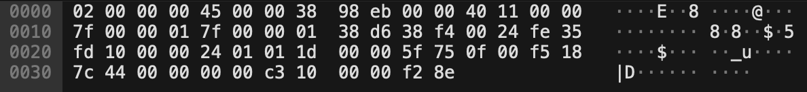

# MAVLink SCALED\_PRESSURE - generates a parser for a single MAVLink SCALED_PRESSURE message

NOTE: This differs from the parser in `mavlink\_single\_message\_repeat` in that it accepts one and only one message of type SCALED_PRESSURE.

All data packets were captured in `.pcap` files using Wireshark, a network protocol analyzer.

## Directory structure

* **xbnf** contains a working parser written in xbnf for a single SCALED_PRESSURE MAVLink message
* **tests** contains a full set of tests for the parser
  * `pass.1` is a single SCALED_PRESSURE message
  * `pass.2` is another single SCALED_PRESSURE message
  * `fail.1` is an ATTITUDE message (incorrect messsage type)
  * `fail.2` is a SCALED_PRESSURE message with the MAVLink version code changed
  * `fail.1` is a SCALED_PRESSURE message with the message id changed
  * `fail.1` is a SCALED_PRESSURE message with the length value changed
  * `fail.5` is a SCALED_PRESSURE message with 1 too few bytes at the end
  * `fail.6` is a SCALED_PRESSURE message with 1 too many bytes at the end
  * `fail.7` is all of the SCALED_PRESSURE messages recorded during a short flight with the drone (message repeates not allowed)
  * `fail.8` is an empty file

## Data packet structure
MAVLink is a lightweight messaging protocol which enables communication between drones and their corresponding gorund control stations.
The format of MAVLink messages is defined in the `common.xml` file and can be found [here](https://mavlink.io/en/messages/common.html).
The data packets are found in packet capture, `.pcap`, files, however for the purpose of constructing tests, the PCAP file header is removed.

* Each message begins with a 16 byte packet record header:
  * Bytes 0 - 3: Timestamp (seconds).
  * Bytes 4 - 7: Timestamp (microseconds or nanoseconds).
  * Bytes 8 - 11: Captured packet length.
  * Bytes 12 - 15: Original packet length.
  
**The header for the SCALED_PRESSURE message follows a standard format and is comprised of the first 32 bytes of the message (following the packer record header)**

* Bytes 0 - 3: Message family (always 0x00000002).
* Byte 4: 4 MSB are IP version ; 4 LSB are header length (0x45 for SCALED_PRESSURE).
* Byte 5: Differentiated service field.
* Bytes 6 - 7: Total length (big endian; 0x3800 for SCALED_PRESSURE)).
* Bytes 8 - 9: Identification.
* Bytes 10 - 11: Flags and fragment offset.
* Byte 12: Time to live.
* Byte 13: Protocol (always 0x11 for UDP).
* Bytes 14 - 15: Header checksum.
* Bytes 16 - 19: Source address.
* Bytes 20 - 23: Destination address.
* Bytes 24 - 25: Source port (big endian).
* Bytes 26 - 27: Destination port (big endian).
* Bytes 28 - 29: Length (big endian; 0x2400 for SCALED_PRESSURE)).
* Bytes 30 - 31: Checksum.

**This is followed by a message-specific header which is 10 bytes in length**
* Byte 32: Magic value/version (always 0xfd for MAVLink 2.0).
* Byte 33: Payload length (0x10 for SCALED_PRESSURE).
* Byte 34: Incompatibility flag.
* Byte 35: Compatibility flag.
* Byte 36: Packet sequence.
* Byte 37: System id.
* Byte 38: Component id.
* Bytes 39 - 41: Message id (0x00001D for SCALED_PRESSURE).

* **SCALED_PRESSURE**: The pressure readings for the typical setup of one absolute and differential pressure sensor.
  * Bytes 42 - 45: *time_boot_ms*: the timestamp representing the time since system boot; *ms*; `uint32_t`.
  * Bytes 46 - 49: *press_abs*: absolute pressure; *hPa*; `float`.
  * Bytes 50 - 53: *press_diff*: differential pressure; *hPa*; `float`.
  * Bytes 54 - 55: *temperature*: absolute pressure temperature; *cdegC*; `int16_t`.
  * Bytes 56 - 57: *temperature_press_diff*: differential pressure temperature (0, if not available). Report values of 0 (or 1) as 1 cdegC.; *cdegC*; `int16_t`.

  
  
All data packets are followed by a 2 byte message cyclic redundancy check which acts as a checksum.
