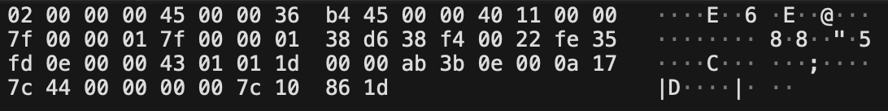

# MAVLink ATTITUDE, GLOBAL\_POSITION\_INT and SCALED_PRESSURE
## Generates a parser for grammar defined for MAVLink messages of type ATTITUDE, GLOBAL\_POSITION\_INT and SCALED\_PRESSURE

NOTE: This is a grammar for 3 MAVLink messages. It accepts zero or more of any of these messages in any combination.

All data packets were captured in `.pcap` files using Wireshark, a network protocol analyzer.

## Directory structure

* **xbnf** contains a working parser written in xbnf for an ATTITUDE message, a GLOBAL\_POSITION\_INT message, a conbination of the two, or no message at all.
* **tests** contains a full set of passing and failing tests for the parser; it is recommended to clean this directory after testing since `tv.sh` generates roughly 30,000 test files

## Data packet structure
MAVLink is a lightweight messaging protocol which enables communication between drones and their corresponding ground control stations.
The format of MAVLink messages is defined in the `common.xml` file and can be found [here](https://mavlink.io/en/messages/common.html).
MAVLink 2.0 truncates empty (zero-filled bytes) at the end of the payload; it will never truncate the first byte of the payload regardless of if it is empty or not. The grammar is thus defined such that it allows for each payload to be any length.

**The message begins with a message-specific message header which is 10 bytes in length.**

* Byte 0: Magic value/version (always 0xFD for MAVLink 2.0)
* Byte 1: Payload length
* Byte 2: Incompatibility flag
* Byte 3: Compatibility flag
* Byte 4: Packet sequence
* Byte 5: System id
* Byte 6: Component id
* Bytes 7 - 9: Message id

**The three message types are defined as follows:**

* **GLOBAL_POSITION_INT**: The filtered global position (e.g. fused GPS and accelerometers). The position is in GPS-frame (right-handed, Z-up).
  * Bytes 10 - 13: *time_boot_ms*: the timestamp representing the time since system boot; *ms*; `uint32_t`.
  * Bytes 14 - 17: *lat*: latitude; *degE7*; `int32_t`.
  * Bytes 18 - 21: *lon*: longitude; *degE7*; `int32_t`.
  * Bytes 22 - 25: *alt*; altitude; *mm*; `int32_t`.
  * Bytes 26 - 29: *relative_alt*; altitude above ground; *mm*; `int32_t`.
  * Bytes 30 - 31: *vx*; ground x speed (latitude, positive north); *cm/s*; `int16_t`.
  * Bytes 32 - 33: *vy*; ground y speed (longitude, positive east); *cm/s*; `int16_t`.
  * Bytes 34 - 35: *vz*; ground z speed (altitude, positive down); *cm/s*; `int16_t`.
  * Bytes 36 - 37: *hdg*; vehicle heading (yaw angle); *cdeg*; `uint16_t`.
  
  
  
* **ATTITUDE**: The attitude in the aeronautical frame (right-handed, Z-down, Y-right, X-front, ZYX, intrinsic)
  * Bytes 10 - 13: *time_boot_ms*: the timestamp representing the time since system boot; *ms*; `uint32_t`.
  * Bytes 14 - 17: *roll*; roll angle (-pi..+pi); *rad*; `float`.
  * Bytes 18 - 21: *pitch*; pitch angle (-pi..+pi); *rad*; `float`.
  * Bytes 22 - 25: *yaw*; yaw angle (-pi..+pi); *rad*; `float`.
  * Bytes 26 - 29: *rollspeed*; roll angular speed; *rad/s*; `float`.
  * Bytes 30 - 33: *pitchspeed*; pitch angular speed; *rad/s*; `float`.
  * Bytes 34 - 37: *yawspeed*; yaw angular speed; *rad/s*; `float`.
  
  

* **SCALED_PRESSURE**: The pressure readings for the typical setup of one absolute and differential pressure sensor.
  * Bytes 10 - 13: *time_boot_ms*: the timestamp representing the time since system boot; *ms*; `uint32_t`.
  * Bytes 14 - 17: *press_abs*: absolute pressure; *hPa*; `float`.
  * Bytes 18 - 21: *press_diff*: differential pressure; *hPa*; `float`.
  * Bytes 22 - 23: *temperature*: absolute pressure temperature; *cdegC*; `int16_t`.
  * Bytes 24 - 25: *temperature_press_diff*: differential pressure temperature (0, if not available). Report values of 0 (or 1) as 1 cdegC.; *cdegC*; `int16_t`.

  

All data packets are followed by a 2 byte message cyclic redundancy check which acts as a checksum.
